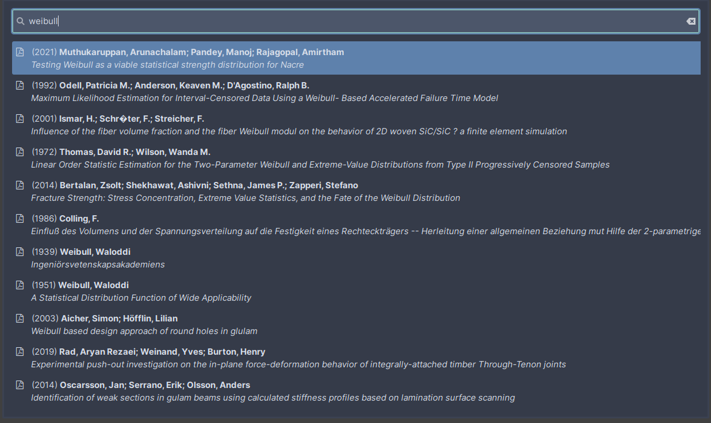

# Wofi-pubs

Wofi-pubs is a (wofi)[https://hg.sr.ht/~scoopta/wofi] interface for the (pubs)[https://github.com/pubs/pubs/] bibliography manager.
It allows to comfortably search for publications by filtering the entries as you type (that's what wofi does mainly).

I mainly created this script to easily display the bibliographies stored in different `pubs` repos, since I wanted to keep different topics separated in different git repos.
This is possible with `pubs`, for which you have to run `pubs` with the `-c` argument in order to choose a different configuration file.
You could improve that with aliases I guess... or you could write a wofi interface to deal with it and add some other functionalities along the way :).
That is wofi-pubs!

Currently wofi-pubs has the following features:

* List references from different libraries
* Add publication by different methods (DOI, bibfile, Arxiv, ISBN and manual entry)
* Open the document
* Edit the reference
* Send reference and document per E-mail
* Send the document to your Sony DPT-RP1


## Requirements

* (wofi)[https://hg.sr.ht/~scoopta/wofi]
* (pubs)[https://github.com/pubs/pubs/]
* (dpt-rp1-py)[https://github.com/pierrecollignon/dpt-rp1-py] (Optional: to send files to Sony DPT-RP1)




## Installation

```
git clone https://github.com/cristobaltapia/wofi-pubs.git
cd wofi-pubs
make install
```

Wofi-pubs is installed per default under `~/.local/bin/wofi-pubs` and the rest of the needed files under `~/.local/lib/wofi-pubs/`.
This directories can be modified with the environmental variables `INSTALL_BIN` and `INSTALL_LIB`, respectively.


## Configuration

Wofi-pubs reads a configuration file in `$XDG_CONFIG_HOME/wofi-pubs/config` (normally defined as `~/.config/wofi-pubs/config`).
The configuration file has the following syntax and options:

```conf
pdfviewer=zathura
wofi=/path/to/wofi # default: /usr/bin/wofi
pubs=/path/to/pubs # default: /usr/bin/pubs
# Directory where to look for the pubs config files for different libraries
configs_dir=$HOME/.config/pubs
default_lib=$HOME/.config/pubs/main_library.conf
terminal_edit=termite
```

### Configuration to send files to Sony DPT-RP1

A file has to be created under `~/.dappp/devices` listing different possible addresses to find the DPT-RP1, with the syntax `name: address` as:
```
WiFi: 192.168.1.101
Bluetooth: 172.25.47.1
```

Any number of entries are allowed here.
Wofi-pubs will ask where to send the file based on the entries in this list.
